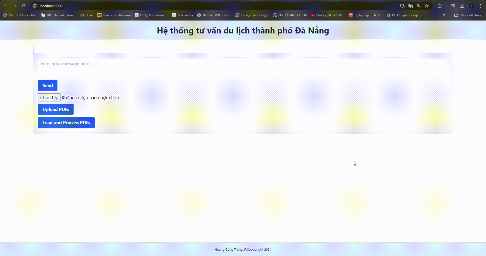

## Table of Contents
- [Demo](#demo)
- [Description](#description)
- [Design System](#design-system)
- [Create Vector Database with PGVector](#vector-database)
- [Installation Frontend](#installation-frontend)
- [Run Application](#run-application)
- [Contact](#contact)

# Demo

# Description
This project implements a Chatbot using Retrieval-Augmented Generation (RAG) with FastAPI, and React.js. The backend, built with FastAPI, handles data retrieval and processing. The frontend, developed in React.js, provides an interactive user interface for seamless chatbot interactions.

# Design System


# Installation Backend
### Install PGVector

Ensure [C++ support in Visual Studio](https://learn.microsoft.com/en-us/cpp/build/building-on-the-command-line?view=msvc-170#download-and-install-the-tools) and [PostgreSQL](https://www.postgresql.org/download/windows/) are installed, and run:

```cmd
call "C:\Program Files\Microsoft Visual Studio\2022\Community\VC\Auxiliary\Build\vcvars64.bat"
```

Note: The exact path will vary depending on your Visual Studio version and edition

Then use `nmake` to build:

```cmd
set "PGROOT=C:\Program Files\PostgreQL\16"
cd %TEMP%
git clone --branch v0.7.2 https://github.com/pgvector/pgvector.git
cd pgvector
nmake /F Makefile.win
nmake /F Makefile.win install
```
### Create Virtual Environment
Then create new environment where contain nessessary packages to this project.
Ensure you have Python 3.10+ installed.
```cmd
python -m venv .venv
```
Activate new enviroment
```cmd
.venv\Scripts\activate
```
Then, install the required dependencies using pip:
```cmd
pip install -r requirements.txt
```
### Notes
You need to create a .env file to store essential keys for the project such as OPENAI_API_KEY, LANGCHAIN_API_KEY, SECRET_KEY,ALLOWED_HOSTS, APP_DEBUG,  and others.

# Create Vector Database with PGVector
Move into the langchain-stream app directory and run command in your terminal:
```cmd
python rag_load_and_process.py
```
Then wait for the process to complete (it may take a few minutes) and check the database for the new table called "langchain_pg_embeding and langchain_pg_collection" in your PostgreSQL database.

# Installation Frontend
Ensure Node.js and npm are installed
run
```cmd
node -v
npm -v
npx -v
```
if installed, you should see their version numbers. For example:
```cmd
v20.8.0
10.1.0
```
### Create a React Application
Let's use a react template for the frontend. In Terminal:
```cmd
npx create-react-app frontend --template typescript
```
This will create a new folder called frontend
Let's move into it:
```cmd
cd frontend
```
Now let's install some necessary modules there:
```cmd
npm install @microsoft/fetch-event-source
```
```cmd
npm install -D tailwindcss
```
```cmd
npx tailwindcss init
```
### Test the Frontend
Start the React development server:
```cmd
npm start
```
Visit the URL shown in your terminal (usually http://localhost:3000/) to view your React app’s welcome page.

# Run Application
All done! To run the application, start the FastAPI server and the React development server
In 2 separate terminals, run:
```cmd
uvicorn app.server:app --reload
```
and in the frontend directory, run:
```cmd
cd frontend
npm start
```
Visit the URL shown in your terminal (usually http://localhost:3000/) to view the app.

# Contact
For questions, contributions, or bug reports, please feel free to reach out:

- Email: [tranvanphuc.dev.it.2002@gmail.com](tranvanphuc.dev.it.2002@gmail.com)
- Linkedin: [https://www.linkedin.com/in/phuc-dut-0082962bb/](https://www.linkedin.com/in/phuc-dut-0082962bb/)

I appreciate your feedback and involvement!


